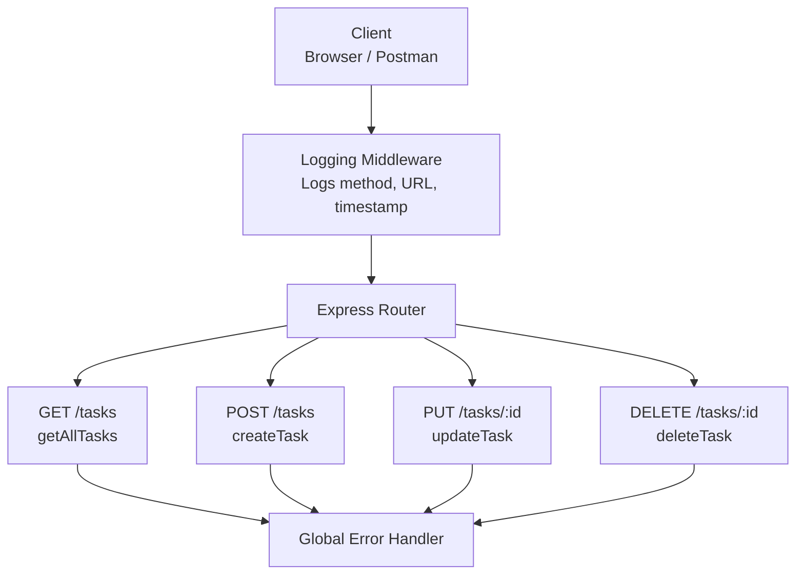

# AWF

## Task Management Backend Architecture

## Problem Definition

Build a Node/Express backend for a Task Management system with the following requirements:

- Implement REST endpoints for creating, reading, updating, and deleting tasks.
- Store tasks in an in-memory array for now, with no database integration.
- Add a request logging middleware that records the HTTP method, request URL, and timestamp for every incoming request.
- Add a global error handling middleware as the last middleware in the pipeline.
- Return the correct HTTP status codes for each response: `200`, `201`, `404`, and `500`.

## Request Flow

1. The client sends a request from a browser or Postman.
2. The logging middleware runs first and records the request details.
3. The request reaches the Express router and the matching task handler.
4. The handler reads from or mutates the in-memory task array.
5. Any failure is passed to the global error handler for a consistent response.