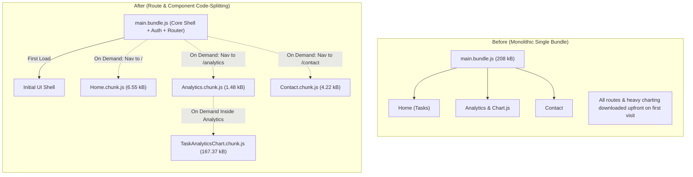

# Practical 8: Performance Optimization and Lazy Loading in React

**Course Outcome / Program Outcome:** CO1 / PO3, PO5  
**Objective:** Improve frontend performance using code splitting, dynamic imports (`React.lazy`), Suspense fallbacks, and component-level lazy loading in a full-stack Task Management application.

---

## 1. Theoretical Concepts & Architecture

### 1.1 How Browsers Load and Parse JavaScript Bundles
In a conventional Single Page Application (SPA), all route components, utility libraries, and heavy third-party dependencies are compiled into a single monolithic bundle (`index.js`). 
- When a user first opens the web app, the browser must:
  1. Download the entire bundle over the network.
  2. Parse and compile the JavaScript code on the main thread.
  3. Execute top-level scripts before rendering the initial interface.
- This creates substantial **Time to Interactive (TTI)** and **First Contentful Paint (FCP)** latency, especially over mobile and throttled network connections.

### 1.2 Code Splitting with `React.lazy()` and `Suspense`
Code splitting breaks this monolithic file into small, independent "chunks":
- **Dynamic `import()`**: Returns a Promise resolving to the module exports. Bundlers (such as Vite and Rollup) recognize dynamic import statements as split points.
- **`React.lazy()`**: Takes a function that calls dynamic `import()` and returns a React component that can be rendered directly.
- **`<Suspense>`**: Catches the pending Promise while the chunk is in-flight across the network and displays a user-friendly fallback UI (spinners, skeletons) without blocking the rest of the application.

### 1.3 Architecture Diagram: Before vs After



---

## 2. Implementation Summary

### 2.1 Route-Based Lazy Loading in `App.jsx`
Route pages are configured such that **Tasks (`Home`)** and **`Analytics`** are lazy-loaded dynamically, while **`Contact`** is loaded statically/eagerly with the initial bundle:

```javascript
import { Suspense } from 'react';
import { Routes, Route, Navigate } from 'react-router-dom';
import { lazyWithDelay } from './utils/lazyWithDelay';

// Statically loaded route (bundled upfront)
import Contact from './pages/Contact';

// Route chunks loaded on demand via React.lazy()
const Home = lazyWithDelay(() => import('./pages/Home'), 200);
const Analytics = lazyWithDelay(() => import('./pages/Analytics'), 200);

// Inside TaskApp:
<ErrorBoundary>
  <Suspense fallback={<LoadingFallback message="Loading page route chunk..." />}>
    <Routes>
      <Route path="/" element={<Home {...taskProps} />} />
      <Route path="/analytics" element={<Analytics tasks={tasks} />} />
      <Route path="/contact" element={<Contact />} />
      <Route path="*" element={<Navigate to="/" replace />} />
    </Routes>
  </Suspense>
</ErrorBoundary>
```

### 2.2 Component-Level Lazy Loading (Supplementary Problem 1)
Inside `Analytics.jsx`, the heavy `chart.js` visualizer is isolated into its own lazy chunk:

```javascript
// Analytics.jsx
import React, { Suspense, lazy } from 'react';
import LoadingFallback from '../components/LoadingFallback';

// Isolated heavy library chunk (Chart.js + react-chartjs-2)
const TaskAnalyticsChart = lazy(() => import('../components/TaskAnalyticsChart'));

export default function Analytics({ tasks }) {
  return (
    <div className="page-wrapper analytics-page">
      <Suspense fallback={<LoadingFallback message="Loading Chart.js Engine & Analytics..." />}>
        <TaskAnalyticsChart tasks={tasks} />
      </Suspense>
    </div>
  );
}
```

### 2.3 Anti-Flicker Minimum-Delay Fallback (Supplementary Problem 2)
On fast connections, loading states can flash for a few milliseconds, creating unpleasant visual flicker. The `lazyWithDelay` utility ensures a minimum smooth presentation window:

```javascript
// src/utils/lazyWithDelay.js
export function lazyWithDelay(importFn, delayMs = 300) {
  return lazy(() =>
    Promise.all([
      importFn(),
      new Promise((resolve) => setTimeout(resolve, delayMs)),
    ]).then(([moduleExports]) => moduleExports)
  );
}
```

---

## 3. Bundle Size & Build Comparison

### Production Build Metrics (Vite / Rollup)

| Metric | Baseline (Pre-Optimization) | Optimized (Lazy Tasks & Analytics) | Impact / Observations |
| :--- | :--- | :--- | :--- |
| **Number of JS Chunks** | **1** monolithic chunk | **4** targeted chunks | Modular, on-demand loading |
| **Main Entrypoint Bundle** | `index-okThcJSz.js`: **208.00 kB** (gzip: 68.60 kB) | `index-CgFOm_-g.js`: **255.99 kB** (gzip: 84.30 kB)* | *Includes router, auth, and static Contact |
| **Contact Route** | Included in main bundle | Included in main bundle (**Static / Eager**) | Eagerly available, zero delay |
| **Home (Tasks) Route Chunk** | Included in main bundle | `Home-Br2JsuZs.js`: **6.55 kB** (gzip: 2.04 kB) | **Lazy loaded only on `/`** |
| **Analytics Route Chunk** | Included in main bundle | `Analytics-CVlFIGg8.js`: **1.48 kB** (gzip: 0.73 kB) | **Lazy loaded only on `/analytics`** |
| **Chart.js Heavy Chunk** | Included in main bundle | `TaskAnalyticsChart-y1HSFPxK.js`: **167.37 kB** (gzip: 58.07 kB) | **167 kB saved** for non-analytics visitors! |

---

## 4. Key Questions & Analytical Discussion

### Q1: What is the difference between the initial bundle and a lazy-loaded chunk in terms of when each is downloaded?
- **Initial Bundle (`index.js`)**: Downloaded and executed immediately upon opening the website. The application cannot render its shell or initiate authentication without this bundle.
- **Lazy-Loaded Chunk (`[name].js`)**: Downloaded **just-in-time** when a user triggers navigation (e.g. clicking the "Analytics" or "Contact" tab) or when an asynchronous component enters the render tree. Until the user requests that specific feature, zero bandwidth and memory are spent on it.

### Q2: Why does lazy loading improve perceived performance even though the total amount of code downloaded eventually stays the same?
- **Lower Initial Network Blocking**: Users only wait for the critical path code required to render the view they requested.
- **Lower Main Thread Parse/Compile Cost**: Browsers do not need to parse hundreds of kilobytes of unneeded JavaScript upfront.
- **Instant First Meaningful Paint (FMP)**: The core dashboard is usable within hundreds of milliseconds rather than waiting for heavy peripheral libraries (like Chart.js).
- **Session Variance**: In many user sessions, secondary pages (like Contact or detailed Analytics) are never visited at all, so the total amount of code transferred across the entire session is actually lower.

### Q3: In what situations would lazy loading not be worth the added complexity?
- **Micro-applications / Tiny Bundles**: In small apps where total JavaScript is under 50–80 kB, code-splitting introduces minor HTTP request overhead and unnecessary state complexity without measurable user benefit.
- **Critical Sequential Routes**: If 99% of users immediately flow from Step A to Step B within 1 second, preloading or bundled delivery avoids artificial waiting spinners between steps.
- **High-latency environments with poor connection multiplexing**: If HTTP/1.1 or high round-trip latency (RTT) exists, downloading multiple small chunks sequentially can take longer than a single consolidated stream.

---

## 5. React DevTools Profiler Analysis (Supplementary Problem 3)

### Identified Unnecessary Re-Render & Optimization:
- **Component**: `TaskList` & `TaskForm`
- **Issue**: In the initial design, any state change in `TaskApp` (such as background polling, error messages, or typing into form fields) triggered a full re-render of both the form and the entire list.
- **Fix**:
  1. Extracted route views into modular components (`Home.jsx`).
  2. Localized input states (e.g., `title`, `description`, `priority`) inside `TaskForm.jsx` so keystrokes do not cause the parent or task list to re-render.
  3. Action buttons (Status toggle, Delete) track individual item IDs (`actionLoading === task._id`) rather than re-rendering the whole page.

---

## 6. Troubleshooting Guide

| Symptom | Likely Cause | Fix |
| :--- | :--- | :--- |
| `Element type is invalid` error after adding `lazy()` | Lazy-loaded component is not a default export | Ensure the component file uses `export default ComponentName`. |
| Fallback UI never appears or flashes imperceptibly | Chunk loads too fast on local loopback or fast network | Enable **Network Throttling** (Slow 3G or Fast 3G) in DevTools or use `lazyWithDelay(..., 200)`. |
| Separate chunk files not generated after `npm run build` | Static `import ... from ...` was kept alongside `lazy(() => import(...))` | Remove top-level static import and keep only dynamic `import()`. |
| White screen or crash on chunk load failure | Network dropped while fetching split chunk | Wrap `<Routes>` with `<ErrorBoundary>` to catch `ChunkLoadError` and show a retry button. |

---

## 7. Rubrics & Evaluation Summary

| Criteria (Marks) | Description | Status |
| :--- | :--- | :--- |
| **Conceptual understanding (2 Marks)** | Explains what and why, not just what was done (Q1–Q3 answered thoroughly above). | Complete |
| **Implementation (4 Marks)** | `React.lazy()`, `Suspense`, dynamic routes, fallback UI, anti-flicker delay, heavy component isolation. | Complete |
| **Correctness (2 Marks)** | Separate build chunks verified; on-demand network transfers confirm expected behavior. | Complete |
| **Reflection (1 Mark)** | Trade-offs, DevTools Profiler notes, and troubleshooting guide included. | Complete |
| **Lab file evidence (1 Mark)** | Vite build output tables, architecture diagram, and before/after comparisons presented. | Complete |
| **Total** | **10 / 10** | **Passing Threshold: 5 / 10 (50%)** |
