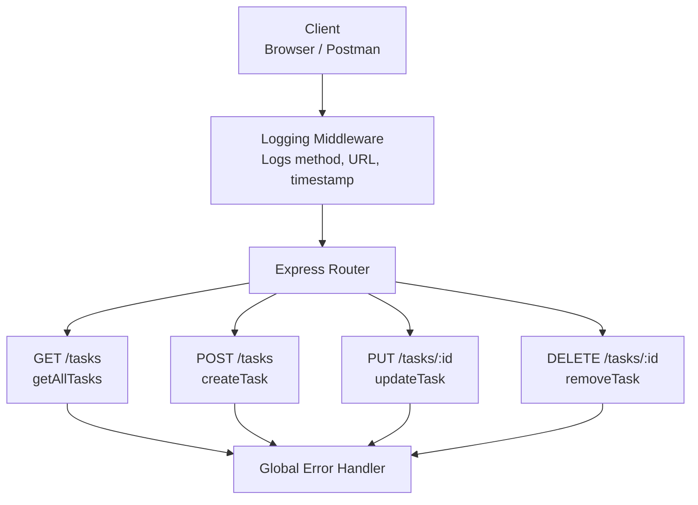

# Task Management System

Node/Express backend for a basic task management API.

## Architecture



## Problem Definition

- Build a Node/Express backend for a Task Management system.
- Implement REST endpoints for creating, reading, updating, and deleting tasks.
- Use an in-memory array for now, with no database.
- Apply a request logging middleware that logs method, URL, and timestamp for every request.
- Apply a global error handling middleware as the last middleware in the pipeline.
- Use correct HTTP status codes: `200`, `201`, `404`, and `500`.

## Run Guide

### Prerequisites

- Node.js 18 or later
- npm

### Install

1. Install dependencies with `npm install`.

### Start

1. Start the API with `npm start`.
2. For development with auto-reload, use `npm run dev`.

### Use the API

Send requests to `http://localhost:3000/tasks`.

- `GET /tasks` to read all tasks.
- `POST /tasks` to create a task.
- `PUT /tasks/:id` to update a task.
- `DELETE /tasks/:id` to delete a task.

Example JSON body for create or update:

```json
{
	"title": "Learn Express",
	"completed": false
}
```

## Sample Data

### GET /tasks

Sample response:

```json
[
	{
		"id": 1,
		"title": "Sample task",
		"completed": false
	}
]
```

### POST /tasks

Sample request body:

```json
{
	"title": "Write API documentation",
	"completed": false
}
```

Sample response:

```json
{
	"id": 2,
	"title": "Write API documentation",
	"completed": false
}
```

### PUT /tasks/:id

Sample request body:

```json
{
	"title": "Write API documentation",
	"completed": true
}
```

Sample response:

```json
{
	"id": 2,
	"title": "Write API documentation",
	"completed": true
}
```

### DELETE /tasks/:id

Sample response:

```json
{
	"id": 2,
	"title": "Write API documentation",
	"completed": true
}
```

## Endpoints

- `GET /tasks`
- `POST /tasks`
- `PUT /tasks/:id`
- `DELETE /tasks/:id`